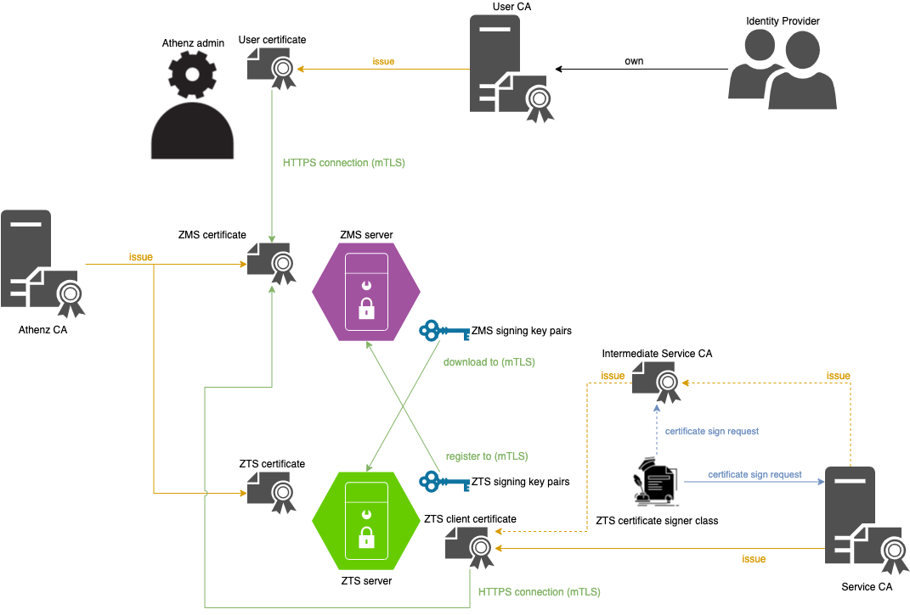

<a id="markdown-athenz-bootstrap-with-docker" name="athenz-bootstrap-with-docker"></a>
# Athenz bootstrap with docker

<!-- TOC -->

- [Athenz bootstrap with docker](#athenz-bootstrap-with-docker)
    - [Athenz components](#athenz-components)
    - [Trust in Athenz](#trust-in-athenz)
    - [Bootstrap steps](#bootstrap-steps)
    - [Appendix](#appendix)
        - [Athenz Demo Playback](#athenz-demo-playback)
        - [points to note](#points-to-note)
        - [automation shortcut](#automation-shortcut)
        - [useful commands](#useful-commands)
        - [TODO](#todo)
            - [will be removed](#will-be-removed)

<!-- /TOC -->

<a id="markdown-athenz-components" name="athenz-components"></a>
## Athenz components


<a id="markdown-trust-in-athenz" name="trust-in-athenz"></a>
## Trust in Athenz

In Athenz, we often have 3 types of CA:
1. Athenz CA
    - issuing certificates for all Athenz components
        - Athenz components include
            - ZMS
            - ZTS
            - Athenz UI
1. User CA
    - issuing certificates for Athenz users
        - Athenz users are users required to access the Athenz API directly
        - Athenz users include
            - Athenz admin
            - Domain admin of other services
    - usually provided by an identity provider
1. Service CA
    - issuing certificates for applications/robots/workloads (service)
    - a service can access Athenz API by
        1. acting on behalf the service user's identity
        1. using the pre-injected service identity during deployment phase
    - usually provided by an identity framework running on the deployment environment
        - example of identity framework
            - Athenz
            - SPIFFE
        - example of deployment environment
            - Kubernetes
            - OpenStack



<a id="markdown-bootstrap-steps" name="bootstrap-steps"></a>
## Bootstrap steps

> If you just want to try out Athenz, please follow [try-out-Athenz-with-self-signed-CA](./try-out-Athenz-with-self-signed-CA.md) and then skip the next step (go to step 4).

1. Ask your CA to sign the following certificates
    - Athenz CA
        - ZMS API server certificate
        - ZTS API server certificate
    - User CA
        - Athenz domain admin certificate
    - Service CA
        - Intermediate CA certificate for ZTS certificate signer
        - ZTS client certificate
1. Set up your deployment environment with [env.sh](../env.sh)
    ```bash
    BASE_DIR="`git rev-parse --show-toplevel`"

    source "${BASE_DIR}/docker/env.sh"
    ```
1. Copy your CAs certificates in `$CA_DIR`
    ```bash
    echo ${ATHENZ_CA_PATH}
    echo ${USER_CA_PATH}
    echo ${SERVICE_CA_PATH}
    ```
1. Set up ZMS ([zms-setup](./zms-setup.md))
1. Set up ZTS ([zts-setup](./zts-setup.md))
1. Verify your setup ([acceptance-test](./acceptance-test.md))

<a id="markdown-appendix" name="appendix"></a>
## Appendix

<a id="markdown-athenz-demo-playback" name="athenz-demo-playback"></a>
### Athenz Demo Playback
- [cast](./cast)
- [](https://asciinema.org/a/D1F3SV50yp4v6IEbw7zRtHu2G)

<a id="markdown-points-to-note" name="points-to-note"></a>
### points to note

1. All Athenz principal are normalized to lower case.

<a id="markdown-automation-shortcut" name="automation-shortcut"></a>
### automation shortcut

```bash
BASE_DIR="`git rev-parse --show-toplevel`"
SETUP_DIR="${BASE_DIR}/docker/setup-scripts"

sh "${SETUP_DIR}/self-signed-certificates.sh"
sh "${SETUP_DIR}/zms-auto-config.sh"
sh "${SETUP_DIR}/zts-auto-config.sh"
```

<a id="markdown-useful-commands" name="useful-commands"></a>
### useful commands

```bash
# reset repo
git reset --hard HEAD; git clean -fdx
```

<a id="markdown-todo" name="todo"></a>
### TODO

1. [WIP] create ZMS & ZTS DB admin user, reference: [setup_zms_prod](https://yahoo.github.io/athenz/site/setup_zms_prod/#mysql-server)
1. rebase to v1.8.39
1. add JWT Authority properties
1. provide CSR template for requesting certificate from public CA
    1. maybe better to split `usr_cert` section in `self-sign.cnf` to 1 more `server_cert` for server certificate
1. report self-sign class fix
1. report `#athens.auth_core.bouncer.domain=user`
1. ask designer about the diagrams
1. [later] integrate `HttpCertSigner` with [Let's Encrypt](https://letsencrypt.org/)
1. [later] fix "Missing key manager password for the key store: " in `com.yahoo.athenz.common.utils.SSLUtils`
    - remove `athenz.zms.client.keymanager_password=dummy` in `zts.properties`
1. [later] support auto ZTS client certificate rotate in ZMS client inside ZTS (`ZMSFileChangeLogStore`)
1. [later] dead link ZMS_JSON_PARSER_ERROR_RESPONSE, need fix

<a id="markdown-will-be-removed" name="will-be-removed"></a>
#### will be removed
```bash
# scp /Users/wfan/Desktop/dev/oss/athenz-CertificateJwtAccessTokenAuthority/target/athenz_certificate_jwt_access_token_authority-1.0.123456789-jar-with-dependencies.jar garm:/home/wfan

# ATHENZ_REPO='/home/wfan/athenz'
# mkdir -p $ATHENZ_REPO/docker/jars
# cp ~/athenz_certificate_jwt_access_token_authority-1.0.123456789-jar-with-dependencies.jar $ATHENZ_REPO/docker/jars/
```
