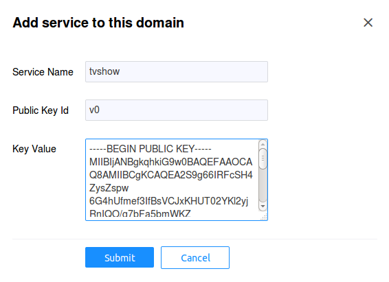
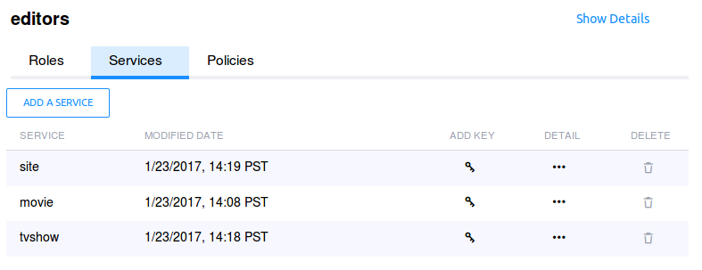
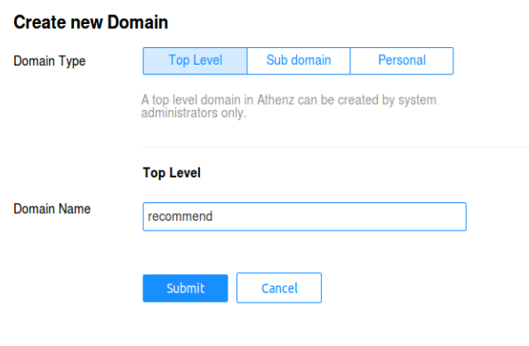
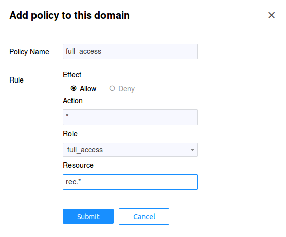

# Client/Servlet Example - Decentralized Access Control
-------------------------------------------------------

* [Required Components](#required-components)
* [Service Definition](#service-definition)
* [Resource Definition](#resource-definition)
* [Athenz Management Setup](#athenz-management-setup)
    * [Client (Tenant) Domain](#client-tenant-domain)
        * [Movie Editors](#movie-editors)
        * [TvShow Editors](#tvshow-editors)
        * [Site Editors](#site-editors)
        * [Service View](#service-view)
    * [Server (Provider) Domain](#server-provider-domain)
        * [Authorization Roles and Policies](#authorization-roles-and-policies)
            * [Movie Access](#movie-access)
            * [TvShow Access](#tvshow-access)
            * [Full Access](#full-access)
* [Code Changes](#code-changes)
    * [Client Changes](#client-changes)
        * [Client Project Dependency Update](#client-project-dependency-update)
        * [Obtaining ZTokens from ZTS Server](#obtaining-ztokens-from-zts-server)
        * [Build Http Client Utility](#build-http-client-utility)
    * [Servlet Changes](#servlet-changes)
        * [Servlet Project Dependency Update](#servlet-project-dependency-update)
        * [Authorization Checks](#authorization-checks)
        * [Build Servlet](#build-servlet)
* [Deploying Example Servlet](#deploying-example-servlet)
* [Test Cases](#test-cases)
    * [Invalid Access Without RoleToken](#invalid-access-without-roletoken)
    * [Movie Editor Access](#movie-editor-access)
    * [TvShow Editor Access](#tvshow-editor-access)
    * [Site Editor Access](#site-editor-access)
    * [Other Test Cases](#other-test-cases)

In the decentralized access control model, the client service/user
presents an authentication token (NToken) from SIA Provider to get an
authorization token (ZToken) from ZTS, and then presents the ZToken
to a target service to access its resources.


The required steps to setup the environment for provider and tenant
services to support decentralized access control are as follows:

* System administrator creates the provider and tenant domains.
* Tenant Domain administrator generates a public/private key pair
  and registers a service in its domain.
* Provider Domain administrator creates a role and policy that
  grants access to the given role with configured action and resource.
* Provider Domain administrator adds the Tenant Service to the
  role to grant access.
* Provider Domain administrator installs Athenz Policy Engine
  Updater (ZPU) on the hosts that will be running the provider
  service. ZPU must be configured with the provider domain name
  and setup to run as a cron job to periodically download the
  latest policy files for the server/provider domain.
* Tenant Domain administrator installs the private key on the host
  that will be running the client/tenant service.

## Required Components
----------------------

To support centralized access control in your applications,
you only need to install and configure all Athenz components:
ZMS and ZTS servers along with the Athenz UI. ZPE Policy
updater needs to be install on the target service host.
Please follow these guides to make sure you have all of
these components up and running in your environment:

* [ZMS Server](setup_zms.md)
* [ZTS Server](setup_zts.md)
* [UI Server](setup_ui.md)

On the provider service's host only install ZPU:

* [ZPU Utility](setup_zpu.md)

To build the client and servlet components of this example,
you need to download and install Oracle JDK 8, Apache Maven and Git client
if you don't already have these available on your box:

* [Oracle Java Platform JDK 8](http://www.oracle.com/technetwork/java/javase/downloads/jdk8-downloads-2133151.html)
* [Apache Maven](http://maven.apache.org/download.cgi)
* [Git client](https://git-scm.com/downloads)

## Service Definition
---------------------

Let's first define our service that needs to be Athenz protected.
We have a simple recommendation service that returns either a movie
or tv show for the caller. It has two endpoints:

    GET /rec/v1/movie
    GET /rec/v1/tvshow

So in this first release we just want to protect access to these
endpoints. We're going to get large number of requests per second
so contacting ZMS server for centralized authorization checks is not
an option. Instead, we have decided to use Athenz' decentralized
authorization model.

## Resource Definition
----------------------

Defining resources and actions the principals are authorized
to execute is one of the most important tasks
in the authorization process. Based on our endpoints, it's expected
that we'll have 2 general resources:

    movie
    tvshow

The resources are referenced in their own domain namespace. So those
are valid if your domain is specifically created to support this
recommendation service only. But's lets assume we might add rental
support later, so we need to make sure the policies are based on
service specific resources. So we'll define our resources as:

    rec.movie
    rec.tvshow

Support action for these resources would be `read`. We can extend
our authorization policies later on if we need to introduce other
actions - such as `write` or `list` as we add more functionality into
our service.

## Athenz Management Setup
--------------------------

Once we have defined what our resources and actions are, we can
create their respective client and server (also commonly referred
as tenant and provider) roles and policies in Athenz. Go to
Athenz UI and login with your account which should have system
administrator access.

### Client (Tenant) Domain
--------------------------

The client services will be defined in the `editors` domain so
let's create that domain and services. Click on the
`Create a domain` link in top left corner to add the domain:


#### Movie Editors
------------------

Each service is identified by its private/public key pair. The
`movie` service will be authorized to access the `/rec/v1/movie` 
endpoint from our recommendation service. So we
need to first generate the key pair (at the end we're going to
display the contents of the public key since we'll be using that
when creating the service in the UI):

```shell
$ openssl genrsa -out movie_private.pem 2048
$ openssl rsa -in movie_private.pem -pubout > movie_public.pem
$ cat movie_public.pem
```

Now we need to register the `movie` service in the `editors` domain.
After you login, click on the `editors` domain in the left hand
tree pane, then choose the `Services` tab. Click on the
`Add Service` button. In the `Key Value` field when creating a
service, enter the contents of the `movie_public.pem` file.
For the `Public Key Id` field we'll use `v0`. Each service
can be identified my multiple key pairs. For example, if you
have services running in different geographical data centers,
each data center instance can have its own unique public/private
key pair. It also allows the service administrator to establish
a key rotation policy - e.g. generate a new key pair every 6
months and assign a new key identifier: v0, v1, etc.


#### TvShow Editors
-------------------

The `tvshow` service will be authorized to access the `/rec/v1/tvshow`
endpoint from our recommendation service. So again, we
need to first generate the key pair (at the end we're going to
display the contents of the public key since we'll be using that
when creating the service in the UI):

```shell
$ openssl genrsa -out tvshow_private.pem 2048
$ openssl rsa -in tvshow_private.pem -pubout > tvshow_public.pem
$ cat tvshow_public.pem
```

Now we need to register the `tvshow` service in the `editors` domain.
After you login, click on the `editors` domain in the left hand
tree pane, then choose the `Services` tab. Click on the
`Add Service` button. In the `Key Value` field when creating a
service, enter the contents of the `tvshow_public.pem` file.
For the `Public Key Id` field we'll use `v0`. See the
`Movie Editors` section for additional details on this field.



#### Site Editors
-----------------

The `site` service will be authorized to access both `/rec/v1/movie`
and `/rec/v1/tvshow` endpoints from our recommendation service. So we
need to first generate the key pair (at the end we're going to
display the contents of the public key since we'll be using that
when creating the service in the UI):

```shell
$ openssl genrsa -out site_private.pem 2048
$ openssl rsa -in site_private.pem -pubout > site_public.pem
$ cat site_public.pem
```

Finally, we need to register the `site` service in the `editors` domain.
After you login, click on the `editors` domain in the left hand
tree pane, then choose the `Services` tab.Click on the
`Add Service` button. In the `Key Value` field when creating a
service, enter the contents of the `site_public.pem` file.
For the `Public Key Id` field we'll use `v0`. See the
`Movie Editors` section for additional details on this field.


#### Service View

Once all three services are successfully registered, you should
have the following `Services` view for the `editors` domains:



### Server (Provider) Domain
----------------------------

The recommendation service will be run by `recommend` property.
So let's first create this domain in Athenz. Click on the
`Create a domain` link in top left corner to add the domain:



#### Authorization Roles and Policies
------------------------------------

Typically since we have two resources and only one action supported
in this use case, we'll be creating 2 roles that will be providing
access control. In this model, if we want one service to have
access to both services, we'll need to add that principal to both
roles. A slightly different approach would be to create yet another
role that provides full access to all recommendation endpoints.

##### Movie Access
------------------

First we need to create the role that includes principals
authorized to access the movie resource. In our example, we'll
call this role as `movie_editors` and include `editors.movie`
service as a member of this role. After you login, click on
the `recommend` domain in the left hand tree pane, then choose
the `Roles` tab. Click on the `Add Role` button:


Now we need to give access to this role with action `read` to
resource `rec.movie`. Choose the `Policies` tab and click on
the `Add Policy` button:


##### TvShow Access
-------------------

Now we need to create the role that includes principals
authorized to access the tvshow resource. In our example, we'll
call this role as `tvshow_editors` and include `editors.tvshow`
service as a member of this role. After you login, click on
the `recommend` domain in the left hand tree pane, then choose
the `Roles` tab. Click on the `Add Role` button:


Now we need to give access to this role with action `read` to
resource `rec.tvshow`. Choose the `Policies` tab and click on
the `Add Policy` button:


##### Full Access
-----------------

Finally, we need to create the role that includes principals
authorized to have full access to any resource in our
recommendation service. In our example, we'll call this role
as `full_access` and include `editors.site` service as a member
of this role. After you login, click on the `recommend` domain
in the left hand tree pane, then choose the `Roles` tab. Click
on the `Add Role` button:


Now we need to give access to this role with action `*` to
resource `rec.*`. Since Athenz support glob style wildcards,
having `*` indicates it will match all actions - e.g. `read`,
`write`, etc. And having the resource as `rec.*` indicates that
it will match `rec.movie`, `rec.tvshow` and any other resource
that we create with the prefix `rec.`. Choose the `Policies` tab
and click on the `Add Policy` button:



## Code Changes
---------------

Both the client and servlet implementors need to make changes
in their respective code bases to support decentralized authorization
checks. The client needs to make sure to retrieve its role token
from ZTS Service and submit that as part of its request, while
the servlet needs to carry out the authorization check based on
that role token to determine if it request should be processed or not.

### Client Changes
------------------

The full client source code is available from:

https://github.com/yahoo/athenz/tree/master/examples/java/decentralized-use-case/client

#### Client Project Dependency Update
-------------------------------------

First you need to update your Java project `pom.xml` file to indicate
the dependency on the Athenz auth_core and zts java client libraries. Checkout the
[Bintray Auth-Core Package](https://bintray.com/yahoo/maven/athenz-auth-core/)
and [Bintray ZTS Java Client Package](https://bintray.com/yahoo/maven/athenz-zts-java-client/)
pages to make sure you're using the latest release version:

```
<dependency>
  <groupId>com.yahoo.athenz</groupId>
  <artifactId>auth_core</artifactId>
  <version>1.1.1</version>
</dependency>
<dependency>
  <groupId>com.yahoo.athenz</groupId>
  <artifactId>zts_java_client</artifactId>
  <version>1.1.1</version>
</dependency>

<repositories>
  <repository>
    <id>bintray-yahoo-maven</id>
    <name>bintray</name>
    <url>http://yahoo.bintray.com/maven</url>
  </repository>
</repositories>
```

#### Obtaining ZTokens from ZTS Server
--------------------------------------

The domain administrator must have already generated a public/private key pair
for the service and registered public key in Athenz. The private key must be
available on the host where the client will be running. First, we need
generate our service identity provider:

```java
    // the fields used in the following snippet of code
    // privateKeyPath -> includes the path to the service's private key file
    //     the corresponding public key is already registered in Athenz
    // domainName -> 'editors'
    // serviceName -> 'movie', 'tvshow' or 'site'
    // keyId -> 'v0'
    
    PrivateKey privateKey = Crypto.loadPrivateKey(new File(privateKeyPath));
    ServiceIdentityProvider identityProvider = new SimpleServiceIdentityProvider(domainName,
            serviceName, privateKey, keyId);
```

Then, we need to contact ZTS Server to retrieve a role token for
the given service identity (provided by the ServiceIdentityProvider)
accessing a target service domain:

```java
    // the fields used in the following snippet of code
    // ztsUrl -> ZTS Server Url
    // domainName -> 'editors'
    // serviceName -> 'movie', 'tvshow' or 'site'
    // identityProvider -> service identity provider created above
    // providerDomain -> 'recommend'
    // providerRole -> 'movie_editors, tvshow_editors, full_access'
    
    RoleToken roleToken = null;
    try (ZTSClient ztsClient = new ZTSClient(ztsUrl, domainName, serviceName,
            identityProvider)) {
        roleToken = ztsClient.getRoleToken(providerDomain, providerRole);
    }
```

Once we have our RoleToken object, then the client before contacting the
provider service needs to include the retrieved token in the request as the
value of Athenz-Role-Auth header.

```java
    // set our Athenz credentials. The ZTSClient provides the header
    // name that we must use for authorization token while the role
    // token itself provides the token string (ztoken).
        
    con.setRequestProperty(ZTSClient.getHeader(), roleToken.getToken());
```

#### Build Http Client Utility
------------------------------

Checkout and build the client component:

```shell
$ git clone https://github.com/yahoo/athenz.git
$ cd examples/java/decentralized-use-case/client/
$ mvn clean package
```

Verify that the client is built successfully:

```shell
$ java -cp target/example-client-ztoken-1.0.jar com.yahoo.athenz.example.ztoken.HttpExampleClient
Missing required options: d, s, p, k, u, z, pd, pr
usage: http-example-client
 -d,--domain <arg>             domain name
 -k,--keyid <arg>              key identifier
 -p,--pkey <arg>               private key path
 -pd,--provider-domain <arg>   Provider domain name
 -pr,--provider-role <arg>     Provider role name
 -s,--service <arg>            service name
 -u,--url <arg>                request url
 -z,--ztsurl <arg>             ZTS Server url
```

### Servlet Changes
-------------------

The full servlet source code is available from:

https://github.com/yahoo/athenz/tree/master/examples/java/decentralized-use-case/servlet

#### Servlet Project Dependency Update
--------------------------------------

First you need to update your Java project `pom.xml` file to indicate
the dependency on the Athenz ZPE Java Client Library. Checkout the
[Bintray ZPE Client Package Page](https://bintray.com/yahoo/maven/athenz-zpe-java-client/)
to make sure you're using the latest release version:

```
<dependency>
  <groupId>com.yahoo.athenz</groupId>
  <artifactId>zpe_java_client</artifactId>
  <version>1.1.1</version>
</dependency>

<repositories>
  <repository>
    <id>bintray-yahoo-maven</id>
    <name>bintray</name>
    <url>http://yahoo.bintray.com/maven</url>
  </repository>
</repositories>
```

#### Authorization Checks
-------------------------

First, we need to make sure the servlet initialization time,
Athenz ZPE Client library is initialized so it can process and
load any domain policy documents retrieved by ZPE Policy Updater.

```java
    public void init() throws ServletException {
        
        // initialize Athenz ZPE client which will load
        // all policy files into memory
        
        AuthZpeClient.init();
    }
```

Before any authorization calls, we're going to check to make sure
our request contains the Athenz role token:

```java
    static final String ATHENZ_HEADER = "Athenz-Role-Auth";
    
    protected void doGet(HttpServletRequest request,
            HttpServletResponse response) throws ServletException, IOException {

        // retrieve and verify that our request contains an Athenz
        // role authorization token
        
        String athenzRoleToken = request.getHeader(ATHENZ_HEADER);
        if (athenzRoleToken == null) {
            response.sendError(403, "Forbidden - No Athenz RoleToken provided in request");
            return;
        }
        
        ...
    }
```

Next, the most important part is to determine the resource and action
based on the given http request.

```java
    protected void doGet(HttpServletRequest request,
            HttpServletResponse response) throws ServletException, IOException {

        ...
    
        switch (reqUri) {
            case "/movie":
                responseText = "Name: Slap Shot; Director: George Roy Hill";
                athenzResource = "rec.movie";
                athenzAction = "read";
                break;
            case "/tvshow":
                responseText = "Name: Middle; Channel: ABC";
                athenzResource = "rec.tvshow";
                athenzAction = "read";
                break;
            default:
                response.sendError(404, "Unknown endpoint");
                return;
        }
    
        ...
    }
```

Once we have those two values determined, then all that is left
is to use ZPE client library for the authorization check.

```java
    protected void doGet(HttpServletRequest request,
            HttpServletResponse response) throws ServletException, IOException {

        ...
        
        // carry out the authorization check with the expected resource
        // and action values

        AccessCheckStatus status = AuthZpeClient.allowAccess(athenzRoleToken,
                athenzResource, athenzAction);
        if (status != AccessCheckStatus.ALLOW) {
            response.sendError(403, "Forbidden - Athenz Authorization Rejected");
            return;
        }
    
        ...
    }
```

#### Build Servlet
------------------

Checkout and build the servlet component:

```shell
$ git clone https://github.com/yahoo/athenz.git
$ cd examples/java/decentralized-use-case/servlet/
$ mvn clean package
```

## Deploying Example Servlet
----------------------------

* Download and install latest [Jetty 9.3.x container](http://www.eclipse.org/jetty/download.html)
* Copy the `athenz-data.war` from the `servlet/target` directory to the Jetty
distribution's `webapps` directory
* Configure ZPU to download the policy documents for domain `recommend`.
```shell
$ vi <zpu-install-directory>/conf/zpe_policy_updater/zpu.conf
```
In the json file, edit the value for the `domains` field to be set to `recommend`.
Run the zpu utility to retrieve the policy documents from ZTS.
```shell
$ <zpu-directory>/bin/zpu_run.sh
$ ls -lat <zpe-directory>/var/zpe/recommend.pol
```
* Configure ZPE library to look for the policy file and the athenz.conf
files in the expected directory:
```shell
$ export JAVA_OPTIONS="-Dathenz.zpe.policy_dir=<zpu-directory>/var/zpe -Dathenz.athenz_conf=<zpu-directory>/conf/zpe_policy_updater/athenz.conf"
```
* Start the Jetty server by running the following command from
Jetty's distribution base directory:
```shell
bin/jetty.sh start
```

## Test Cases
-------------

Run the following test cases to verify authorization access
for specific services. We're running jetty server on the local
box so we're using localhost as the hostname.

* Copy the `example-client-ztoken-1.0.jar` file from the client/target
directory to the directory that includes the private keys for the test
services we created in the section `Client (Tenant) Domain` above.
* If the ZTS Server is running with a self-signed certificate,
we need to generate a truststore for the java http client to use
when communicating with the ZTS Server. From your ZTS Server installation,
copy the `zts_cert.pem` file from the `athenz-zts-X.Y/var/zts_server/certs`
directory into the same directory where the client ztoken utility is
saved (previous step) and execute the following commands:
```shell
$ keytool -importcert -noprompt -alias zts -keystore zts_truststore.jks -file zts_cert.pem -storepass athenz
```

### Invalid Access Without RoleToken
---------------------------------------

For this test case we'll just use the curl client directly:

```shell
$ curl http://localhost:8080/athenz-data/rec/v1/movie
<html>
...
<title>Error 403 Forbidden - No Athenz RoleToken provided in request</title>
...
</html>
```

### Movie Editor Access
-----------------------

Movie service can successfully access /rec/v1/movie endpoint:

```shell
$ java -Djavax.net.ssl.trustStore=./zts_truststore.jks -cp ./example-client-ztoken-1.0.jar com.yahoo.athenz.example.ztoken.HttpExampleClient -d editors -s movie -p ./movie_private.pem -k v0 -pd recommend -pr movie_editors -z https://<zts-server>:8443/zts/v1 -u http://localhost:8080/athenz-data/rec/v1/movie

Successful response:
Name: Slap Shot; Director: George Roy Hill
```

Movie service does not have access to /rec/v1/tvshow endpoint:

```shell
$ java -Djavax.net.ssl.trustStore=./zts_truststore.jks -cp ./example-client-ztoken-1.0.jar com.yahoo.athenz.example.ztoken.HttpExampleClient -d editors -s movie -p ./movie_private.pem -k v0 -pd recommend -pr movie_editors -z https://<zts-server>:8443/zts/v1 -u http://localhost:8080/athenz-data/rec/v1/tvshow

Request was forbidden - not authorized
```

### TvShow Editor Access
------------------------

TvShow service can successfully access /rec/v1/tvshow endpoint:

```shell
$ java -Djavax.net.ssl.trustStore=./zts_truststore.jks -cp ./example-client-ztoken-1.0.jar com.yahoo.athenz.example.ztoken.HttpExampleClient -d editors -s tvshow -p ./tvshow_private.pem -k v0 -pd recommend -pr tvshow_editors -z https://<zts-server>:8443/zts/v1 -u http://localhost:8080/athenz-data/rec/v1/tvshow

Successful response:
Name: Middle; Channel: ABC
```

TvShow service does not have access to /rec/v1/movie endpoint:

```shell
$ java -Djavax.net.ssl.trustStore=./zts_truststore.jks -cp ./example-client-ztoken-1.0.jar com.yahoo.athenz.example.ztoken.HttpExampleClient -d editors -s tvshow -p ./tvshow_private.pem -k v0 -pd recommend -pr tvshow_editors -z https://<zts-server>:8443/zts/v1 -u http://localhost:8080/athenz-data/rec/v1/tvshow

Request was forbidden - not authorized
```

### Site Editor Access
----------------------

Site service has access to both /rec/v1/tvshow and /rec/v1/movie endpoints:

```shell
$ java -Djavax.net.ssl.trustStore=./zts_truststore.jks -cp ./example-client-ztoken-1.0.jar com.yahoo.athenz.example.ztoken.HttpExampleClient -d editors -s site -p ./site_private.pem -k v0 -pd recommend -pr full_access -z https://<zts-server>:8443/zts/v1 -u http://localhost:8080/athenz-data/rec/v1/movie

Successful response:
Name: Slap Shot; Director: George Roy Hill

$ java -Djavax.net.ssl.trustStore=./zts_truststore.jks -cp ./example-client-ztoken-1.0.jar com.yahoo.athenz.example.ztoken.HttpExampleClient -d editors -s site -p ./site_private.pem -k v0 -pd recommend -pr full_access -z https://<zts-server>:8443/zts/v1 -u http://localhost:8080/athenz-data/rec/v1/tvshow

Successful response:
Name: Middle; Channel: ABC
```

### Other Test Cases
--------------------

Now you can modify the `movie_editos, tvshow_editors, and site_editors` roles
in the `recommend` domain to add and remove the defined services. After you
make the changes, it will take about a minute for the updates to propagate
from ZMS to the ZTS Server. Then you need to run the zpu_run.sh command again
to fetch the updated policy files for the domain onto your host. Then you can
run the corresponding test cases to verify your access change.
