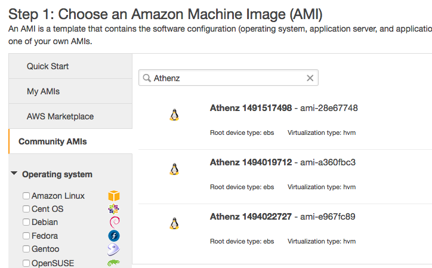

# Setup Amazon EC2 instance
---------------------------

* [Requirements](#requirements)
    * [AWS Account](#aws-account)
* [Launch EC2 instance](#launch-ec2-instance)
* [Start/Stop Athenz](#startstop-athenz)

## Requirements
---------------

### AWS account
---------------

AWS account is required to create an ec2 instance for athenz. If you don't
have an AWS account, you can check out [AWS Free Tier](https://aws.amazon.com/free/).


## Launch EC2 instance
----------------------

Once you are signed into AWS console, select `Services` and click on `EC2`:


Launch a new instance by clicking on `Launch Instance`:


On `Step 1: Choose an Amazon Machine Image (AMI)`, click on `Community AMIs`
and search for "Athenz" in the `Search community AMIs` field:



You might get back multiple matches. The numeric value after `Athenz` is
the timestamp when the image was built so pick the image with the highest
value which would be the latest release. Click on `Select` button next
to the image name to continue.

On `Step 2: Choose an Instance Type` pick an instance with multiple vCPUs
and at 8GiB. However, for evaluation purposes, you can also pick `t2.micro`
type to be eligible for Free tier.


Then, click on `Next:Configure Instance Details` button in the left bottom
corner to continue.

On `Step 3: Configure Instance Details` select `Enable` for the
`Auto-assign Public IP` option so that your instance reachable from
the Internet:


Click on `Next: Add Storage`, then on `Next: Add Tags` and finally on
`Next: Configure Security Group` to get to Step 6.

On `Step 6: Configure Security Group` select `Add Rule`, choose
`Custom TCP Rule` for Type field, 4443 for Port Range field and
0.0.0.0/0 for Source field. Repeat adding a rule for ports 8443
and 9443. Once completed, your setup should be:


Next, click on `Review and Launch` and then on `Launch`.
Finally, select an existing key pair or create a new key
pair for your instance, check the acknowledgement box and
click on `Launch Instances` to launch your Athenz EC2 instance.

## Start/Stop Athenz
--------------------

After your EC2 instance is launched, you need to ssh to your
instance and start Athenz services. During the first start-up,
the Athenz services will be automatically configured with default
settings and self-signed certificates. After you have connected
and logged onto your instance, execute the following commands:

```shell
$ cd /opt/athenz
$ sudo ./start.sh
```

The EC2 instance includes all three Athenz Services - ZMS, ZTS and UI.
They're running on the following ports:

| Service | Port |
|---------|------|
|   ZMS   | 4443 |
|   ZTS   | 8443 |
|   UI    | 9443 |

To access Athenz UI, open your browser with url https://{ec2-instance-public-dns-name}:9443/athenz
Since the services are running with self-signed certificates, configure your browser to
ignore the warnings regarding the UI server certificate.

The instance is configured with the following default user details:

 |  User  | Password |
 |--------|----------|
 | athenz |  athenz  |

To stop Athenz, execute the following commands:

```shell
$ cd /opt/athenz
$ sudo ./stop.sh
```
